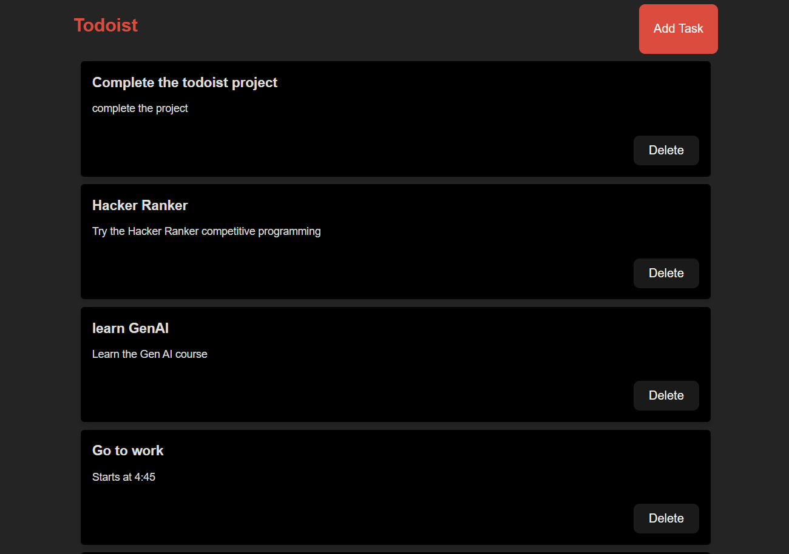

# Todoist Task Manager
This is a simple task manager application built with Flask for the backend and React for the frontend. The application allows users to create, view, and delete tasks.

### Features
- Create a new task with a title and description
- View all tasks
- Delete a task

### Screenhots

Home page of the app where you can view all the pending tasks and can make changes like add a new task, delete etc..

Add task modal which allows the user to input the task title and description.

### Installation
#### Prerequisites

Make sure you have the following installed:

- Python 3.8+
- Node.js
- npm (Node Package Manager)
#### Backend
- Clone the repository:
~~~
 git clone https://github.com/jerinpious/Task-Manager.git
 cd todoist-task-manager
 ~~~
- Navigate to the backend directory:
 ~~~
 cd backend
 ~~~
- Install the required packages:
 ~~~
 pip install -r requirements.txt
 ~~~
- Run the Flask app:
 ~~~
 python main.py
 ~~~
- The backend server should now be running at http://127.0.0.1:5000.
#### Frontend
- Navigate to the frontend directory:
 ~~~
 cd ./frontend
 ~~~
- Install the required packages:
 ~~~
 npm install
 ~~~
- Start the React app:
 ~~~
 npm start
 ~~~
- The frontend should now be running at http://localhost:3000

### Backend
The backend is built with Flask and uses SQLAlchemy for database interactions. It includes the following routes:

- GET /tasks: Retrieve all tasks
- POST /create_task: Create a new task
- DELETE /delete_task/<int:task_id>: Delete a task by ID

### Frontend
- App.jsx: Main component that includes state management and renders the TaskForm and TaskList components.
- TaskForm.jsx: Form component to create a new task.
- TaskList.jsx: Component to display all tasks with delete functionality

### Contributing
Contributions are welcome! Please fork the repository and create a pull request with your changes.
